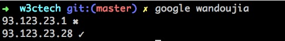

## 案例分析之google

在命令行使用google绕过限制访问服务，并自动开启浏览器打开可用的地址

如图：




####工具依赖：

* querystring：	  获取url里面对应的query值
* util：           
* request：       请求必备
* async：         asynchronous
* yc-open:		  open浏览器

> 这里依赖一个ip库(json文件)


##### async

```shell

//返回一个数组的ips
function getIPDatas() {
	return require('./lib/ips');
}

async.mapLimit(getIPDatas(), 50, checkIp, function(err, results){
	//...
});
```

我们来看看async.mapLimit的实现：

```shell

var _eachLimit = function (limit) {

    return function (arr, iterator, callback) {
        callback = callback || function () {};
        if (!arr.length || limit <= 0) {
            return callback();
        }
        var completed = 0;
        var started = 0;
        var running = 0;

        (function replenish () {
            if (completed >= arr.length) {
                return callback();
            }

            while (running < limit && started < arr.length) {
                started += 1;
                running += 1;
                iterator(arr[started - 1], function (err) {
                    if (err) {
                        callback(err);
                        callback = function () {};
                    }
                    else {
                        completed += 1;
                        running -= 1;
                        if (completed >= arr.length) {
                            callback();
                        }
                        else {
                            replenish();
                        }
                    }
                });
            }
        })();
    };
};


var doParallelLimit = function(limit, fn) {
    return function () {
        var args = Array.prototype.slice.call(arguments);
        return fn.apply(null, [_eachLimit(limit)].concat(args));
    };
};

var _mapLimit = function(limit) {
    return doParallelLimit(limit, _asyncMap);
};

async.mapLimit = function (arr, limit, iterator, callback) {
    return _mapLimit(limit)(arr, iterator, callback);
};
```


##### 发请求，请求ip库中第一个可以的

```shell
request.head('http://' + ip, function(error, response, body){
	if (error) {
		//...
		
	} else {
		//...

	}
});
```


##### yc-open 只是做一件事情：用浏览器打开指定的url

说说open的原理把：

* 


